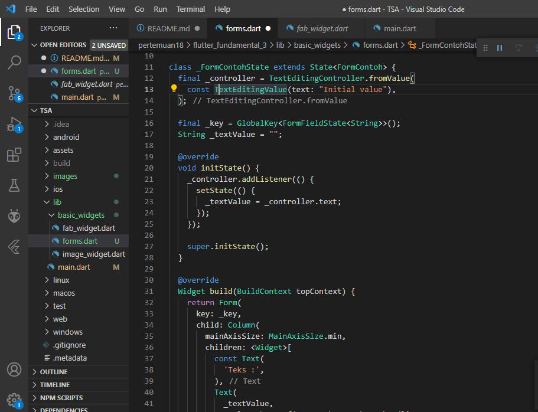
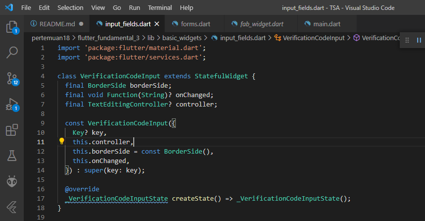

# Praktikum 1: Menerapkan Gesture Detector

## Langkah 1: Buat Project Baru

Buatlah sebuah project flutter baru dengan nama `flutter_fundamental_3`. Lalu jadikan repository di GitHub Anda dengan nama `flutter-fundamental-part3`.

## Langkah 2: Menambahkan GestureDetector

Buka file `main.dart` lalu ganti bagian `body` dengan kode berikut. Untuk `MyImageWidget()` dapat Anda ganti dengan widget milik Anda sendiri.


## Langkah 3: Buat Dokumentasi atau Laporan Praktikum

Simpan lalu coba untuk Run project Anda. Untuk kode `MyImageWidget()` di sini menampilkan logo Polinema seperti gambar berikut. Jika Anda coba klik/tap pada gambar, maka angka di bawah akan terus bertambah. Mengapa demikian? Jelaskan dalam laporan README.md! Jangan lupa kode dan hasil tampilannya di screenshot.


## Langkah 4: Eksperimen Jenis Gesture Lain

Sekarang Anda ganti kode bagian `onTap` dari Langkah 2 dengan `onDoubleTap` dan `onLongPress`. Lalu screenshot masing-masing hasil tampilannya dan jelaskan fungsinya!

* Menggunakan `onDoubleTap`

Action akan dijalankan ketika user melakukan tap sebanyak dua kali, berikut kode programnya.

```
body: Center(
        // Center is a layout widget. It takes a single child and positions it
        // in the middle of the parent.
        child: GestureDetector(
          onDoubleTap: _incrementCounter,
          child: Column(
            mainAxisAlignment: MainAxisAlignment.center,
            children: <Widget>[
              const MyImageWidget(),
              Text(
                '$_counter',
                style: Theme.of(context).textTheme.headline4,
              ),
            ],
          ),
        ),
      ),
```

* Menggunakan `onLongPress`

Action akan dijalankan ketika user melakukan tap yang ditahan. Berikut kode programnya.

```
body: Center(
        // Center is a layout widget. It takes a single child and positions it
        // in the middle of the parent.
        child: GestureDetector(
          onLongPress: _incrementCounter,
          child: Column(
            mainAxisAlignment: MainAxisAlignment.center,
            children: <Widget>[
              const MyImageWidget(),
              Text(
                '$_counter',
                style: Theme.of(context).textTheme.headline4,
              ),
            ],
          ),
        ),
      ),
```

# Praktikum 2: Menerapkan Input Widget dan Forms

## Langkah 1: Buat class FormContoh

Buatlah file baru dengan nama `forms.dart` lalu buat class `FormContoh` seperti kode berikut


## Langkah 2: Buat class _FormContohState

Kemudian buat class state-nya




## Langkah 3: Tambah Widget FormContoh di main.dart

Lalu pindah ke file `main.dart` dan panggil widget `FormContoh` tersebut yang telah dibuat.


Jangan lupa sesuaikan kode dan import di file `main.dart` kemudian akan tampil gambar seperti berikut. Jika terdapat error atau warning, silakan diperbaiki.


# Praktikum 3: Menerapkan Custom Input dan FormField Widget

## Langkah 1: Buat class VerificationCodeInput

Buat file `input_fields.dart` lalu isi kode seperti berikut.



## Langkah 2: Buat class _VerificationCodeInputState

Kemudian dibawahnya buat class `_VerificationCodeInputState` yang di-extends dengan State.


## Langkah 3: Buat class VerificationCodeFormField

Masih di file `input_fields.dart`, buatlah class `VerificationCodeFormField` seperti berikut yang diletakkan dibawahnya.


## Langkah 4: Buat class _VerificationCodeFormFieldState

Selanjutnya buat class state-nya seperti berikut.


## Langkah 5: Tambah variabel _controller

Buka file main.dart lalu tambahkan variabel `_controller` di dalam class extends State


## Langkah 6: Tambah Widget VerificationCodeFormField

Lalu masuk ke method Widget build pada bagian children: tambahkan Form seperti kode berikut. Lakukan import dari file `input_fields.dart` untuk `VerificationCodeFormField`.


